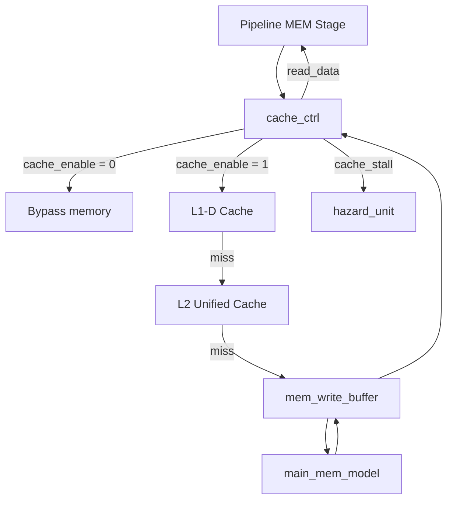

# Arquitectura de Jerarquía de Memoria — SecuRISC-32

## 1. Objetivo

Este documento describe la jerarquía de memoria implementada para SecuRISC-32 en el Proyecto Grupal II. El objetivo de esta extensión es permitir la medición del impacto de la caché de datos sobre el rendimiento del procesador segmentado, manteniendo compatibilidad con la ISA GAEM del Proyecto Grupal I.

La jerarquía implementada sigue esta organización:

```text
Pipeline MEM → cache_ctrl → L1-D → L2 → write buffer → memoria principal
```

Cuando la caché se deshabilita, la misma interfaz se mantiene pero las solicitudes se envían a una memoria de bypass. Esto permite comparar la ejecución funcional con y sin caché usando el mismo procesador y los mismos programas.

---

## 2. Archivos principales

| Archivo               | Función                                                    |
| --------------------- | ---------------------------------------------------------- |
| `cache_hierarchy.sv`  | Wrapper que conecta caché L1-D, L2, write buffer y memoria |
| `cache_ctrl.sv`       | Controlador principal de la jerarquía                      |
| `cache_l1d.sv`        | Caché de datos L1                                          |
| `cache_l2.sv`         | Caché L2 unificada                                         |
| `main_mem_model.sv`   | Modelo de memoria principal con latencia multiciclo        |
| `mem_write_buffer.sv` | Buffer de escritura para evictions dirty hacia memoria     |
| `cpu_top.sv`          | Integra la jerarquía con la etapa MEM del pipeline         |

---

## 3. Diagrama conceptual



La señal `cache_stall` es la conexión crítica con el pipeline. Mientras esta señal está activa, el procesador congela el PC y los registros de pipeline necesarios para evitar corrupción del estado.

---

## 4. Interfaz con el pipeline

`cache_hierarchy.sv` expone una interfaz simple hacia la etapa MEM:

| Señal          | Dirección | Descripción                                     |
| -------------- | --------- | ----------------------------------------------- |
| `cache_enable` | Entrada   | Activa caché cuando es diferente de cero        |
| `mem_read`     | Entrada   | Solicitud de lectura desde MEM                  |
| `mem_write`    | Entrada   | Solicitud de escritura desde MEM                |
| `addr`         | Entrada   | Dirección efectiva calculada en EX              |
| `write_data`   | Entrada   | Dato de store                                   |
| `read_data`    | Salida    | Dato leído para write back                      |
| `cache_stall`  | Salida    | Congela el pipeline mientras se atiende un miss |
| `wb_empty`     | Salida    | Indica que el write buffer está vacío           |

Además, expone contadores de rendimiento:

| Contador            | Descripción                         |
| ------------------- | ----------------------------------- |
| `perf_l1_accesses`  | Accesos totales a L1-D              |
| `perf_l1_hits`      | Hits en L1-D                        |
| `perf_l1_misses`    | Misses en L1-D                      |
| `perf_l2_hits`      | Hits en L2 después de miss en L1    |
| `perf_l2_misses`    | Misses en L2                        |
| `perf_mm_accesses`  | Accesos a memoria principal         |
| `perf_stall_cycles` | Ciclos con stall generado por caché |

---

## 5. Caché L1-D

La caché L1-D se implementa en:

```text
src/cpu/cache_l1d.sv
```

### 5.1 Parámetros

| Propiedad       | Valor                 |
| --------------- | --------------------- |
| Tamaño          | 4 KB                  |
| Asociatividad   | 2-way set associative |
| Sets            | 64                    |
| Tamaño de línea | 32 bytes              |
| Palabras/línea  | 8 palabras de 32 bits |
| Política write  | Write-back            |
| Miss de store   | Write-allocate        |
| Reemplazo       | LRU con 1 bit por set |
| Hit time        | 1 ciclo lógico        |

### 5.2 División de dirección

Para una dirección de 32 bits:

```text
[31:11] tag         21 bits
[10:5]  set index    6 bits
[4:2]   word offset  3 bits
[1:0]   byte offset  ignorado por alineamiento a palabra
```

### 5.3 Operaciones principales

| Operación        | Descripción                                                  |
| ---------------- | ------------------------------------------------------------ |
| Lookup           | Consulta combinacional de ambas vías                         |
| Read hit         | Retorna la palabra solicitada                                |
| Write hit        | Actualiza una palabra de la línea y marca `dirty=1`          |
| Fill             | Instala una línea completa proveniente de L2/memoria         |
| Victim selection | Selecciona la vía LRU                                        |
| Dirty eviction   | Expone dirección y datos de la línea víctima para write-back |

### 5.4 Justificación de diseño

La L1-D se eligió 2-way set associative porque reduce misses por conflicto frente a una caché directa, pero mantiene baja la complejidad de implementación en SystemVerilog. El reemplazo LRU con 1 bit por set es suficiente para dos vías y evita estructuras complejas de conteo.

La política write-back reduce tráfico hacia L2, porque las escrituras no se propagan inmediatamente. La política write-allocate se utiliza porque, después de un store miss, es probable que el programa vuelva a acceder a la misma línea por localidad temporal o espacial.

---

## 6. Caché L2

La caché L2 se implementa en:

```text
src/cpu/cache_l2.sv
```

### 6.1 Parámetros

| Propiedad       | Valor                                    |
| --------------- | ---------------------------------------- |
| Tamaño          | 16 KB                                    |
| Asociatividad   | 4-way set associative                    |
| Sets            | 128                                      |
| Tamaño de línea | 32 bytes                                 |
| Palabras/línea  | 8 palabras de 32 bits                    |
| Política write  | Write-back                               |
| Reemplazo       | Pseudo-LRU de 3 bits por set             |
| Hit time        | Modelado mediante espera en `cache_ctrl` |

### 6.2 División de dirección

Para una dirección de 32 bits:

```text
[31:12] tag        20 bits
[11:5]  set index   7 bits
[4:0]   offset      5 bits
```

L2 opera a granularidad de línea completa. No extrae palabras individuales; esa responsabilidad queda en `cache_ctrl.sv` al llenar L1-D.

### 6.3 Pseudo-LRU

La política pseudo-LRU usa un árbol binario de 3 bits por set:

```text
         b[2]
        /    
      b[1]  b[0]
      / \    / \
     w0 w1  w2 w3
```

La política aproxima LRU sin almacenar un orden completo de las cuatro vías. Esto reduce el costo de estado y lógica, manteniendo una selección razonable de víctima.

### 6.4 Justificación de diseño

L2 es 4-way para reducir conflictos antes de ir a memoria principal. Como el acceso a memoria principal es mucho más costoso que un hit en L2, conviene dedicar más capacidad y asociatividad a este nivel.

La política write-back se justifica porque evita propagar cada escritura hasta memoria principal. Las líneas modificadas solo se escriben hacia memoria cuando son reemplazadas.

---

## 7. Memoria principal

La memoria principal se implementa en:

```text
src/cpu/main_mem_model.sv
```

### 7.1 Parámetros

| Propiedad          | Valor base                                                   |
| ------------------ | ------------------------------------------------------------ |
| Capacidad          | 64 KB (`DEPTH=16384` palabras de 32 bits)                    |
| Ancho de palabra   | 32 bits                                                      |
| Tamaño de línea    | 256 bits / 32 bytes                                          |
| Palabras por línea | 8                                                            |
| Latencia base      | 25 ticks de memoria (`LATENCY=25`)                           |
| Latencia efectiva  | `LATENCY * MEM_CLK_DIV` ciclos de CPU (default 25 x 4 = 100) |
| Inicialización     | `INITIAL_MEM` o `INIT_FILE` mediante `$readmemh`             |

### 7.2 Protocolo de acceso

Lectura:

```text
1. cache_ctrl emite req=1, we=0, addr=line_base
2. main_mem_model espera 25 ciclos
3. ready=1 por un ciclo
4. rdata contiene la línea de 256 bits
```

Escritura:

```text
1. cache_ctrl/write buffer emite req=1, we=1, addr=line_base, wdata=line
2. main_mem_model espera 25 ciclos
3. ready=1 por un ciclo
4. La línea queda escrita en memoria
```

### 7.3 Nota sobre dominio de reloj

La especificación del proyecto solicita simular una memoria externa más lenta que el procesador. La memoria opera con el **mismo reloj físico** que el procesador, pero su FSM de latencia avanza únicamente cuando la señal interna `tick` está en alto (una vez cada `MEM_CLK_DIV` ciclos de CPU). Esto modela una frecuencia de memoria más baja mediante un esquema de clock-enable, sin introducir un segundo dominio de reloj real (sin CDC ni PLL).

La latencia efectiva resultante es `LATENCY * MEM_CLK_DIV` ciclos de CPU:

- `MEM_CLK_DIV = 1`: usado por los testbenches unitarios (`tb_main_mem_model`, `tb_cache_ctrl`, `tb_cache_hierarchy`); latencia = `LATENCY` ciclos.
- `MEM_CLK_DIV = 4`: default de sistema en `cpu_top.sv` y el `Makefile`; memoria a ~25 MHz (asumiendo CPU a 100 MHz), latencia efectiva = `LATENCY * 4 = 100` ciclos de CPU.
- Override en tiempo de compilación: `make sv-cpu-exec MEM_CLK_DIV=<n>`.

Esto reproduce el efecto observable para el pipeline: stalls prolongados y penalización por miss.

---

## 8. Write buffer

El write buffer se implementa en:

```text
src/cpu/mem_write_buffer.sv
```

Su función es recibir líneas sucias expulsadas de L2 y drenarlas hacia memoria principal. Es el **único dueño del puerto `mm`**: `cache_ctrl` ya no accede a `main_mem_model` directamente, sino que encola writebacks (`enq`) y solicita fetches por handshake (`rd_req`/`rd_ready`/`rd_data`) al buffer, que arbitra el puerto de memoria principal.

| Propiedad      | Descripción                                                        |
| -------------- | ------------------------------------------------------------------ |
| Estructura     | FIFO de 4 entradas (`DEPTH=4`)                                     |
| Entrada        | Dirección + línea de 256 bits                                      |
| Salida         | Transacciones hacia `main_mem_model.sv`                            |
| Propósito      | Evitar serializar siempre fetches con evictions                    |
| Observabilidad | Expone `empty` (hasta `cpu_top` como `wb_empty`)                   |
| Métricas       | `perf_wb_drains`, `perf_wb_conflict_drains`, `perf_wb_full_stalls` |

### 8.1 Manejo de conflictos

Si se solicita leer una línea que está pendiente en el write buffer, el buffer drena primero la escritura conflictiva antes de permitir la lectura. Esto evita leer datos obsoletos desde memoria principal.

### 8.2 Justificación de diseño

El write buffer mejora el comportamiento de la jerarquía al permitir que algunas evictions sucias se escriban en segundo plano. Sin este buffer, todo miss que expulsara una línea dirty de L2 tendría que bloquear el fetch de la nueva línea hasta terminar la escritura previa.

---

## 9. Controlador de caché

El controlador principal se encuentra en:

```text
src/cpu/cache_ctrl.sv
```

Su función es recibir solicitudes de la etapa MEM, consultar la jerarquía y mantener `cache_stall` activo hasta que el acceso pueda completarse.

### 9.1 Estados de la FSM

| Estado         | Función                                               |
| -------------- | ----------------------------------------------------- |
| `IDLE`         | Espera solicitudes; atiende hits en L1                |
| `L1_WRITEBACK` | Escribe una víctima dirty de L1 hacia L2              |
| `L2_LOOKUP`    | Consulta L2 después de un miss en L1                  |
| `L2_WAIT`      | Modela la latencia del hit en L2                      |
| `MEM_FETCH`    | Solicita una línea a memoria principal                |
| `L2_FILL`      | Instala en L2 la línea traída desde memoria principal |
| `L1_FILL`      | Instala en L1 la línea final y completa la solicitud  |

### 9.2 Flujo de L1 hit

```text
IDLE → L1 hit → responder read_data o ejecutar write-hit → IDLE
```

No se generan stalls adicionales.

### 9.3 Flujo de L1 miss + L2 hit

```text
IDLE → L2_LOOKUP → L2_WAIT → L1_FILL → IDLE
```

El pipeline se mantiene congelado mediante `cache_stall` hasta que la línea se instala en L1.

### 9.4 Flujo de L1 miss + L2 miss

```text
IDLE → L2_LOOKUP → MEM_FETCH → L2_FILL → L1_FILL → IDLE
```

En este caso `MEM_FETCH` no accede a `main_mem` directamente: usa el handshake de lectura del write buffer (`wb_rd_req`/`wb_rd_ready`/`wb_rd_data`), que arbitra el puerto de memoria principal y paga la latencia efectiva (`LATENCY * MEM_CLK_DIV` ciclos de CPU, 100 con el default de sistema). Si la víctima de L2 es dirty, `L2_LOOKUP` la encola en el write buffer en el mismo ciclo y transiciona directo a `MEM_FETCH`; el writeback drena en segundo plano en lugar de serializarse antes del fetch.

### 9.5 Evictions dirty

| Caso                | Acción                                               |
| ------------------- | ---------------------------------------------------- |
| Víctima dirty en L1 | Se escribe la línea hacia L2 mediante `L1_WRITEBACK` |
| Víctima dirty en L2 | Se encola la línea en `mem_write_buffer`             |
| Buffer lleno        | El controlador mantiene stall hasta poder continuar  |

---

## 10. Coherencia entre L1 y L2

La jerarquía mantiene una relación inclusiva funcional entre L1 y L2 para las líneas cargadas desde memoria principal. Las actualizaciones se manejan así:

| Evento                  | Manejo                                                                 |
| ----------------------- | ---------------------------------------------------------------------- |
| Read miss en L1, hit L2 | La línea de L2 se copia hacia L1                                       |
| Read miss en L1 y L2    | La línea se trae de memoria, se instala en L2 y luego en L1            |
| Store hit en L1         | Se actualiza L1 y se marca dirty                                       |
| Eviction dirty de L1    | La línea modificada se escribe de vuelta hacia L2                      |
| Eviction dirty de L2    | La línea se manda al write buffer para escribirse en memoria principal |

La coherencia relevante para este proyecto es coherencia interna entre niveles de caché, no coherencia multiprocesador. El sistema ejecuta una sola aplicación a la vez.

---

## 11. Stalls del pipeline

La señal `cache_stall` se activa cuando una solicitud de memoria no puede resolverse inmediatamente.

| Situación         | `cache_stall` | Resultado                                   |
| ----------------- | ------------- | ------------------------------------------- |
| No hay acceso MEM | 0             | El pipeline avanza                          |
| L1 hit            | 0             | El pipeline avanza                          |
| L1 miss           | 1             | El PC y registros de pipeline se congelan   |
| Espera de L2      | 1             | El pipeline permanece detenido              |
| Espera de memoria | 1             | El pipeline permanece detenido              |
| Llenado de L1     | 1             | Se completa la solicitud antes de continuar |

Esta señal entra a `hazard_unit.sv`, donde tiene prioridad sobre RAW hazards y flushes de control.

---

## 12. Contadores de rendimiento

El controlador de caché implementa contadores internos para medir comportamiento de memoria.

| Contador            | Descripción                         |
| ------------------- | ----------------------------------- |
| `perf_l1_accesses`  | Accesos totales a L1-D              |
| `perf_l1_hits`      | Hits en L1-D                        |
| `perf_l1_misses`    | Misses en L1-D                      |
| `perf_l2_hits`      | Hits en L2                          |
| `perf_l2_misses`    | Misses en L2                        |
| `perf_mm_accesses`  | Fetches desde memoria principal     |
| `perf_stall_cycles` | Ciclos de stall generados por caché |

Estos contadores son exportados hacia `cpu_top.sv` y luego reportados por `tb_cpu_program.sv` en:

```text
build/sim/metrics.txt
```

---

## 13. Cálculo de métricas derivadas

A partir de los contadores se calculan:

```text
L1 hit rate = perf_l1_hits / perf_l1_accesses
L1 miss rate = perf_l1_misses / perf_l1_accesses
L2 hit rate = perf_l2_hits / (perf_l2_hits + perf_l2_misses)
L2 miss rate = perf_l2_misses / (perf_l2_hits + perf_l2_misses)
Memoria transferida = perf_mm_accesses * 32 bytes
BW utilization = bytes transferidos / ciclos totales
```

Una forma práctica de estimar AMAT es:

```text
AMAT = L1_hit_time
     + L1_miss_rate * (L2_hit_time + L2_miss_rate * memory_penalty)
```

Con los valores del modelo:

```text
L1_hit_time = 1 ciclo
L2_hit_time ≈ 8 ciclos
memory_penalty = LATENCY * MEM_CLK_DIV ciclos de CPU (default 25 x 4 = 100)
```

El factor `MEM_CLK_DIV` es esencial: usar solo `LATENCY` reportaría un AMAT optimista que no corresponde a la penalización real que experimenta el pipeline. `tb_cpu_program.sv` reporta tanto el AMAT analítico como uno medido (`HT_L1 + perf_cache_stall_cycles / perf_l1_accesses`) para validación cruzada.

---

## 14. Validación mediante testbenches

| Testbench                | Validación principal                                           |
| ------------------------ | -------------------------------------------------------------- |
| `tb_cache_l1d.sv`        | Fill, read hit, read miss, write-hit, dirty victim y LRU       |
| `tb_cache_l2.sv`         | Fill, hit, miss, write-line, dirty victim y pseudo-LRU         |
| `tb_cache_ctrl.sv`       | Estados de la FSM, L1 hit, L2 hit, memoria, write-allocate     |
| `tb_main_mem_model.sv`   | Latencia exacta de 25 ciclos y transacciones read/write        |
| `tb_mem_write_buffer.sv` | Enqueue, full, background drain y drain-on-conflict            |
| `tb_cache_hierarchy.sv`  | Integración completa con bypass, cold miss, hit posterior y WB |
| `tb_cpu_program.sv`      | Ejecución completa, métricas y comparación con/sin caché       |

---

## 15. Configuración de ejecución

### 15.1 Ejecutar sin caché

```bash
make sv-cpu-exec PROGRAM=programs/hex/cache_stress.hex CACHE_ENABLE=0 MAX_CYCLES=5000
```

### 15.2 Ejecutar con caché

```bash
make sv-cpu-exec PROGRAM=programs/hex/cache_stress.hex CACHE_ENABLE=1 MAX_CYCLES=5000
```

### 15.3 Verificar equivalencia funcional

```bash
make verify-cache-modes PROGRAM=programs/hex/cache_stress.hex MAX_CYCLES=5000
```

Este objetivo compara el dump de registros generado con caché deshabilitada contra el generado con caché habilitada.

---

## 16. Trade-offs de diseño

| Decisión            | Ventaja                                    | Costo / Riesgo                              |
| ------------------- | ------------------------------------------ | ------------------------------------------- |
| L1 2-way            | Reduce conflictos frente a direct-mapped   | Más lógica que una caché directa            |
| L2 4-way            | Reduce misses antes de memoria principal   | Mayor lógica de comparación                 |
| Write-back          | Reduce tráfico hacia niveles inferiores    | Requiere dirty bits y write-back            |
| Write-allocate      | Aprovecha localidad después de stores      | Un store miss requiere traer línea completa |
| LRU en L1           | Simple y efectivo para 2 vías              | No escala bien a más vías                   |
| Pseudo-LRU en L2    | Menor costo que LRU real                   | Puede no escoger la víctima óptima          |
| Write buffer        | Evita serializar todas las evictions dirty | Requiere manejo de conflictos               |
| Bypass configurable | Facilita comparar con/sin caché            | Aumenta lógica del wrapper                  |

---

## 17. Notas y limitaciones

- La implementación actual reporta contadores agregados de accesos/hits/misses. Para cumplir un desglose más fino, se pueden agregar contadores separados para lecturas y escrituras.
- El modelo de memoria principal modela una frecuencia más baja mediante clock-enable (`MEM_CLK_DIV`) sobre un único dominio de reloj físico; reproduce el efecto de memoria lenta sin implementar un cruce real de dominios de reloj (CDC) ni PLL.
- La jerarquía está orientada a un solo procesador y una sola aplicación; no implementa coherencia multiprocesador.
- El pipeline interno de las cachés no se modela como estructura separada; el controlador introduce los stalls necesarios para representar los tiempos de acceso.
