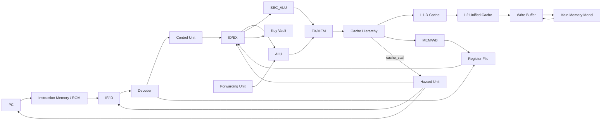

# Microarquitectura — SecuRISC-32

## 1. Visión general

SecuRISC-32 implementa un procesador RISC de 32 bits en SystemVerilog con una microarquitectura segmentada de cinco etapas:

```text
IF → ID → EX → MEM → WB
```

La implementación conserva la ISA GAEM definida en el Proyecto Grupal I y extiende la organización interna del procesador con pipeline, manejo de hazards, forwarding, jerarquía de caché L1-D/L2, modelo de memoria principal con latencia multiciclo y contadores de rendimiento.

| Aspecto                  | Decisión de diseño                                                              |
| ------------------------ | -------------------------------------------------------------------------------- |
| Tipo de procesador       | RISC de 32 bits                                                                  |
| Organización             | Pipeline de 5 etapas                                                             |
| Etapas                   | IF, ID, EX, MEM, WB                                                              |
| Memoria de instrucciones | ROM/IMEM separada, acceso directo desde IF                                       |
| Memoria de datos         | Jerarquía L1-D → L2 → memoria principal, con bypass configurable                 |
| Ancho de palabra         | 32 bits                                                                          |
| Ancho de instrucción     | 32 bits                                                                          |
| Banco de registros       | 32 registros de 32 bits                                                          |
| Unidad de seguridad      | `sec_alu.sv`                                                                     |
| Bóveda de llaves         | `key_vault.sv`                                                                   |
| Jerarquía de caché       | `cache_hierarchy.sv`, `cache_ctrl.sv`, `cache_l1d.sv`, `cache_l2.sv`             |
| Memoria principal        | `main_mem_model.sv`                                                              |
| Write buffer             | `mem_write_buffer.sv`                                                            |
| Módulo principal         | `cpu_top.sv`                                                                     |

El diseño está orientado a simulación ciclo a ciclo con Icarus Verilog. La finalidad principal es medir el impacto de la jerarquía de memoria y de las optimizaciones del compilador sobre métricas como ciclos totales, IPC, misses de caché, stalls y tráfico hacia memoria principal.

---

## 2. Diagrama general de bloques

El datapath base del procesador se encuentra representado en:

```text
Datapath_PGA1.pdf
```

Para el Proyecto Grupal II, el diagrama conceptual extendido es:



La integración clave del Proyecto Grupal II se ubica en la etapa MEM. En lugar de conectar la etapa MEM directamente a una memoria de datos simple, el procesador usa `cache_hierarchy.sv`, que decide si la solicitud se atiende desde una memoria de bypass o desde la jerarquía L1-D/L2/memoria principal.

---

## 3. Módulo principal `cpu_top.sv`

El módulo principal de integración es:

```text
src/cpu/cpu_top.sv
```

Este módulo instancia y conecta los principales bloques del procesador:

| Instancia      | Módulo                 | Función                                                        |
| -------------- | ---------------------- | -------------------------------------------------------------- |
| `u_pc`         | `pc.sv`                | Mantiene el Program Counter                                    |
| `u_pc_adder`   | `pc_adder.sv`          | Calcula `PC + 4`                                               |
| `u_imem`       | `instr_mem.sv`         | Memoria de instrucciones                                       |
| `u_decoder`    | `decoder.sv`           | Decodifica campos de instrucción                               |
| `u_cu`         | `control_unit.sv`      | Genera señales de control                                      |
| `u_rf`         | `register_file.sv`     | Banco de registros de 32 entradas                              |
| `u_alu`        | `alu.sv`               | Operaciones aritméticas y lógicas                              |
| `u_sec_alu`    | `sec_alu.sv`           | Operaciones de seguridad                                       |
| `u_key_vault`  | `key_vault.sv`         | Almacenamiento protegido de llaves                             |
| `u_cache`      | `cache_hierarchy.sv`   | Jerarquía de memoria L1-D/L2/memoria principal                 |
| `u_hazard`     | `hazard_unit.sv`       | Control de stalls y flushes                                    |
| `u_forwarding` | `forwarding_unit.sv`   | Reenvío de resultados entre etapas                             |

El módulo recibe como parámetros:

| Parámetro       | Descripción                                                                 |
| --------------- | --------------------------------------------------------------------------- |
| `XLEN`          | Ancho de palabra del procesador, por defecto 32 bits                        |
| `IMEM_DEPTH`    | Profundidad de la memoria de instrucciones                                  |
| `DMEM_DEPTH`    | Profundidad de la memoria de datos o memoria principal simulada             |
| `CACHE_ENABLE`  | Habilita la jerarquía de caché cuando es diferente de cero                  |
| `PROGRAM_FILE`  | Archivo `.hex` usado para inicializar la memoria de instrucciones           |
| `INITIAL_MEM`   | Archivo `.mem` usado para inicializar memoria de datos/memoria principal    |

---

## 4. Registros de pipeline

La microarquitectura utiliza registros intermedios definidos como `struct packed` dentro de `isa_defs.sv`.

### 4.1 Registro IF/ID

El registro `if_id_t` guarda la información generada en la etapa de búsqueda de instrucción.

| Campo      | Descripción                                            |
| ---------- | ------------------------------------------------------ |
| `pc`       | PC de la instrucción actual                            |
| `instr`    | Instrucción obtenida desde la memoria de instrucciones |
| `pc_plus4` | Dirección de la siguiente instrucción secuencial       |

### 4.2 Registro ID/EX

El registro `id_ex_t` guarda operandos, inmediatos y señales de control necesarias para ejecutar la instrucción.

| Campo       | Descripción                              |
| ----------- | ---------------------------------------- |
| `pc`        | PC de la instrucción                     |
| `pc_plus4`  | PC + 4                                   |
| `rs1_data`  | Dato leído del registro fuente 1         |
| `rs2_data`  | Dato leído del registro fuente 2         |
| `k_out`     | Palabra leída desde la bóveda de llaves  |
| `imm_ext`   | Inmediato extendido                      |
| `rs1_addr`  | Dirección de `rs1`                       |
| `rs2_addr`  | Dirección de `rs2`                       |
| `rd_addr`   | Dirección del registro destino           |
| `pc_src`    | Selección de siguiente PC                |
| `wb_src`    | Fuente para write back                   |
| `alu_op`    | Operación de ALU                         |
| `sec_op`    | Operación de seguridad                   |
| `reg_write` | Habilita escritura en banco de registros |
| `mem_write` | Habilita escritura en memoria            |
| `alu_src`   | Selecciona operando B de ALU             |
| `branch`    | Indica instrucción branch                |
| `jal`       | Indica salto con enlace                  |
| `vault_we`  | Habilita escritura en la bóveda          |

### 4.3 Registro EX/MEM

El registro `ex_mem_t` guarda los resultados producidos en la etapa de ejecución y las señales necesarias para la etapa MEM.

| Campo          | Descripción                       |
| -------------- | --------------------------------- |
| `alu_result`   | Resultado de la ALU               |
| `sec_result`   | Resultado de la ALU de seguridad  |
| `rs2_data`     | Dato utilizado para stores        |
| `pc_plus4`     | PC + 4                            |
| `pc_imm`       | Dirección objetivo para branch    |
| `rd_addr`      | Registro destino                  |
| `wb_src`       | Fuente de write back              |
| `reg_write`    | Escritura en banco de registros   |
| `mem_write`    | Escritura en memoria              |
| `vault_we`     | Escritura en bóveda               |
| `branch_taken` | Resultado de evaluación de branch |

### 4.4 Registro MEM/WB

El registro `mem_wb_t` guarda los valores disponibles para la etapa de escritura.

| Campo        | Descripción                           |
| ------------ | ------------------------------------- |
| `alu_result` | Resultado proveniente de la ALU       |
| `sec_result` | Resultado proveniente de `sec_alu`    |
| `mem_rdata`  | Dato leído desde memoria/caché        |
| `pc_plus4`   | PC + 4                                |
| `rd_addr`    | Registro destino                      |
| `wb_src`     | Selector de fuente de write back      |
| `reg_write`  | Habilita escritura final en registros |

---

## 5. Etapas del datapath

### 5.1 Instruction Fetch

La etapa IF obtiene la instrucción desde la memoria de instrucciones.

```text
PC → instr_mem → if_instr
PC → pc_adder  → PC + 4
```

El PC se actualiza con `if_pc_next` cuando `pc_write` está habilitado. Si ocurre un hazard o un stall por caché, la unidad de riesgos deshabilita la actualización del PC.

Componentes usados:

| Módulo         | Función                |
| -------------- | ---------------------- |
| `pc.sv`        | Registro del PC        |
| `pc_adder.sv`  | Cálculo de `PC + 4`    |
| `instr_mem.sv` | Lectura de instrucción |

### 5.2 Instruction Decode

La etapa ID decodifica la instrucción, lee registros y genera señales de control.

```text
if_id_reg.instr → decoder → opcode, funct3, funct7, rs1, rs2, rd, imm
opcode/funct3/funct7 → control_unit → señales de control
rs1/rs2 → register_file → datos fuente
```

El decoder extrae los campos de la instrucción según el ISA GAEM y extiende los inmediatos según el tipo de instrucción.

Para instrucciones U-type, el diseño usa:

```systemverilog
final_rs1_addr = id_u_load ? id_rd_addr : id_rs1_addr
```

Esto permite que `luhw` y `llhw` construyan constantes de 32 bits usando el registro destino como fuente parcial.

### 5.3 Execute

La etapa EX ejecuta operaciones aritméticas, lógicas, operaciones de seguridad y evaluación de branches.

#### Camino ALU

La ALU recibe:

```text
a = ex_forwarded_rs1
b = ex_alu_b
```

El segundo operando se selecciona con:

```text
ex_alu_b = alu_src ? imm_ext : ex_forwarded_rs2
```

La ALU produce:

| Señal           | Descripción                |
| --------------- | -------------------------- |
| `ex_alu_result` | Resultado de operación ALU |
| `ex_Z`          | Flag zero                  |
| `ex_N`          | Flag negative              |
| `ex_C`          | Flag carry                 |
| `ex_V`          | Flag overflow              |

#### Camino de seguridad

La ALU de seguridad recibe:

```text
a      = ex_forwarded_rs1
b      = ex_forwarded_rs2
key    = id_ex_reg.k_out
sec_op = id_ex_reg.sec_op
auth_en = auth_bit
```

Produce:

```text
ex_sec_result
```

Las operaciones soportadas son `SEC_ADDK`, `SEC_XORK` y `SEC_TEA`. Las operaciones `SEC_AUTH` y `SEC_LDK` controlan el estado de autenticación y la escritura en bóveda, pero no producen write back directo.

#### Branch

Los branches se evalúan con los flags producidos por la ALU. Para branches, la unidad de control configura `alu_op = ALU_SUB`, de modo que la comparación se derive de `rs1 - rs2`.

| Branch | Condición        |
| ------ | ---------------- |
| `beq`  | `Z = 1`          |
| `bne`  | `Z = 0`          |
| `blt`  | `N != V`         |
| `bgt`  | `!Z && (N == V)` |
| `bge`  | `N == V`         |
| `ble`  | `Z || (N != V)`  |

La dirección objetivo se calcula como:

```text
ex_pc_imm = id_ex_reg.pc + id_ex_reg.imm_ext
```

### 5.4 Memory Access

La etapa MEM accede a memoria cuando la instrucción es `lw` o `sw`.

En la implementación extendida, esta etapa se conecta a `cache_hierarchy.sv`.

```text
EX/MEM.alu_result → cache_hierarchy.addr
EX/MEM.rs2_data   → cache_hierarchy.write_data
cache_hierarchy.read_data → MEM/WB.mem_rdata
```

La señal de lectura hacia la jerarquía se deriva de:

```systemverilog
ch_mem_read = (ex_mem_reg.wb_src == WB_MEM)
```

La señal de escritura se toma de:

```systemverilog
mem_write = ex_mem_reg.mem_write
```

Cuando `CACHE_ENABLE = 0`, la jerarquía usa una memoria de bypass. Cuando `CACHE_ENABLE != 0`, la solicitud se atiende mediante L1-D, L2 y memoria principal.

### 5.5 Write Back

La etapa WB escribe el resultado final en el banco de registros cuando `reg_write` está activo.

| Selector | Fuente                 |
| -------- | ---------------------- |
| `WB_ALU` | Resultado de ALU       |
| `WB_MEM` | Dato leído de memoria  |
| `WB_PC4` | PC + 4                 |
| `WB_SEC` | Resultado de `sec_alu` |

El write back ocurre mediante:

```text
wb_data → register_file[rd]
```

---

## 6. Unidad de control

La unidad de control se encuentra en:

```text
src/cpu/control_unit.sv
```

Recibe:

```text
opcode
funct3
funct7
```

Y genera:

| Señal       | Función                                                   |
| ----------- | --------------------------------------------------------- |
| `pc_src`    | Selección de fuente para el siguiente PC                  |
| `reg_write` | Habilita escritura en registros                           |
| `mem_write` | Habilita escritura en memoria                             |
| `alu_src`   | Selecciona inmediato o registro como segundo operando ALU |
| `jal`       | Indica instrucción `jal`                                  |
| `u_load`    | Indica operación U-type                                   |
| `branch`    | Indica instrucción branch                                 |
| `wb_src`    | Selecciona dato para write back                           |
| `alu_op`    | Selecciona operación de ALU                               |
| `sec_op`    | Selecciona operación de seguridad                         |

La unidad de control es combinacional. Las señales de control viajan por los registros de pipeline junto con los datos de la instrucción.

---

## 7. Actualización del PC

El siguiente valor del PC se selecciona con prioridad:

```text
1. Branch tomado en EX
2. Jump PC-relative detectado en ID
3. Jump register detectado en ID
4. PC + 4
```

La lógica principal es:

```text
if branch_taken:
    next_pc = branch_target
else if pc_src == PC_IMM:
    next_pc = if_id_reg.pc + imm
else if pc_src == PC_JR:
    next_pc = rs1_data
else:
    next_pc = PC + 4
```

La unidad de riesgos puede detener el PC mediante `pc_write = 0`, especialmente ante hazards RAW o stalls generados por la jerarquía de caché.

---

## 8. Unidad de forwarding

La unidad de forwarding se encuentra en:

```text
src/cpu/forwarding_unit.sv
```

Su función es reducir riesgos de datos reenviando resultados recientes hacia la etapa EX.

| Valor | Fuente                           |
| ----- | -------------------------------- |
| `00`  | Valor original desde `id_ex_reg` |
| `10`  | Resultado reenviado desde EX/MEM |
| `01`  | Resultado reenviado desde MEM/WB |

Esto permite resolver dependencias como:

```asm
add x5, x1, x2
sub x6, x5, x3
```

sin esperar necesariamente a que `x5` sea escrito definitivamente en el banco de registros.

---

## 9. Unidad de riesgos

La unidad de riesgos se encuentra en:

```text
src/cpu/hazard_unit.sv
```

Genera señales para controlar stalls y flushes:

| Señal         | Función                                               |
| ------------- | ----------------------------------------------------- |
| `pc_write`    | Permite o detiene la actualización del PC             |
| `if_id_write` | Permite o detiene la actualización del registro IF/ID |
| `if_id_flush` | Limpia la instrucción en IF/ID                        |
| `id_ex_flush` | Limpia la instrucción en ID/EX                        |

La unidad considera tres fuentes principales de control:

| Caso                 | Acción principal                                             |
| -------------------- | ------------------------------------------------------------ |
| `cache_stall = 1`    | Congela PC e IF/ID; evita avance del pipeline                |
| RAW hazard           | Congela PC e IF/ID; inserta burbuja en ID/EX                 |
| Branch tomado        | Hace flush de IF/ID e ID/EX                                  |
| Jump tomado          | Hace flush de IF/ID                                          |

El stall por caché tiene prioridad sobre los demás casos porque representa una solicitud de memoria aún no resuelta.

---

## 10. Jerarquía de memoria

La jerarquía de memoria se implementa en:

```text
src/cpu/cache_hierarchy.sv
src/cpu/cache_ctrl.sv
src/cpu/cache_l1d.sv
src/cpu/cache_l2.sv
src/cpu/main_mem_model.sv
src/cpu/mem_write_buffer.sv
```

La ruta normal de un acceso de datos es:

```text
Pipeline MEM → cache_ctrl → L1-D → L2 → write buffer / main memory
```

Cuando la caché está deshabilitada, `cache_hierarchy.sv` enruta las solicitudes hacia una memoria de bypass, útil para comparar resultados funcionales con y sin caché.

### 10.1 L1-D

| Parámetro       | Valor                                      |
| --------------- | ------------------------------------------ |
| Tamaño          | 4 KB                                       |
| Asociatividad   | 2-way set associative                      |
| Sets            | 64                                         |
| Línea           | 32 bytes / 8 palabras de 32 bits           |
| Política write  | Write-back                                 |
| Miss de store   | Write-allocate                             |
| Reemplazo       | LRU con 1 bit por set                      |

### 10.2 L2

| Parámetro       | Valor                                      |
| --------------- | ------------------------------------------ |
| Tamaño          | 16 KB                                      |
| Asociatividad   | 4-way set associative                      |
| Sets            | 128                                        |
| Línea           | 32 bytes / 8 palabras de 32 bits           |
| Política write  | Write-back                                 |
| Reemplazo       | Pseudo-LRU de 3 bits por set               |

### 10.3 Memoria principal

La memoria principal se modela en `main_mem_model.sv` como una memoria de palabras de 32 bits con transferencias por línea completa de 256 bits.

| Parámetro       | Valor base                                  |
| --------------- | ------------------------------------------- |
| Línea transferida | 256 bits / 32 bytes                       |
| Latencia          | 25 ciclos                                 |
| Inicialización    | `$readmemh` mediante `INITIAL_MEM`         |
| Transacción       | Pulso `req`, espera, pulso `ready`         |

La implementación modela el costo temporal de memoria externa mediante espera multiciclo en simulación. Esto permite generar stalls prolongados medibles sin modificar la ISA.

---

## 11. Integración caché-pipeline

La jerarquía de caché expone la señal:

```systemverilog
cache_stall
```

Esta señal se conecta a la unidad de riesgos. Cuando `cache_stall = 1`, la unidad de riesgos congela el PC y el registro IF/ID para evitar que el procesador avance mientras el acceso de memoria está pendiente.

Comportamiento general:

| Caso                  | Efecto sobre el pipeline                                      |
| --------------------- | ------------------------------------------------------------- |
| L1 hit                | No se agregan stalls                                           |
| L1 miss + L2 hit      | Se mantiene `cache_stall` hasta llenar L1                     |
| L1 miss + L2 miss     | Se accede a memoria principal y se mantiene el stall          |
| Dirty L1 eviction     | La línea modificada se escribe de vuelta hacia L2             |
| Dirty L2 eviction     | La línea se encola en el write buffer para drenaje a memoria  |

El controlador de caché usa una FSM interna para secuenciar los casos de miss, write-back, fetch de memoria, llenado de L2 y llenado de L1.

---

## 12. Bóveda de llaves

La bóveda de llaves se implementa en:

```text
src/cpu/key_vault.sv
```

Parámetros principales:

| Parámetro       | Valor por defecto | Descripción                   |
| --------------- | ----------------- | ----------------------------- |
| `XLEN`          | 32                | Ancho de palabra              |
| `KEYS`          | 4                 | Cantidad de llaves            |
| `WORDS_PER_KEY` | 4                 | Palabras de 32 bits por llave |

La bóveda se modela como un arreglo de 16 palabras de 32 bits. La escritura solo ocurre cuando:

```text
vault_we = 1
auth_en = 1
```

La dirección se toma de los bits bajos del operando usado como índice:

```text
addr = rs2_data[3:0]
```

---

## 13. Autenticación

El procesador mantiene un bit interno de autenticación:

```text
auth_bit
```

Este bit se actualiza cuando se ejecuta una instrucción `auth`. La contraseña esperada es:

```text
0xDEADBEEF
```

Comportamiento:

```text
if sec_op == SEC_AUTH:
    if rs1_data == 0xDEADBEEF:
        auth_bit = 1
    else:
        auth_bit = 0
```

Si `auth_bit = 0`, la bóveda no permite escritura y las operaciones de seguridad dependientes de llave no producen resultados útiles.

---

## 14. ALU de seguridad

La ALU de seguridad se encuentra en:

```text
src/cpu/sec_alu.sv
```

Entradas principales:

| Entrada   | Descripción                   |
| --------- | ----------------------------- |
| `a`       | Primer operando               |
| `b`       | Segundo operando              |
| `key`     | Palabra leída desde la bóveda |
| `sec_op`  | Operación de seguridad        |
| `auth_en` | Estado de autenticación       |

Operaciones principales:

### 14.1 `SEC_ADDK`

```text
result = a + key
```

### 14.2 `SEC_XORK`

```text
result = a ^ key
```

### 14.3 `SEC_TEA`

```text
result = ((a << 4) + key) ^ b ^ ((a >> 5) + key)
```

### 14.4 Detección de ataque cero

La ALU de seguridad incluye una defensa simple contra extracción directa de llaves mediante operaciones identidad.

La señal `zero_attack_detected` se activa cuando:

```text
a == 0
sec_op == SEC_ADDK o SEC_XORK
```

Si ocurre una operación no autorizada o se detecta este patrón, se activa `exception` y la simulación se detiene mediante `$fatal` desde `cpu_top.sv`.

---

## 15. Memoria de instrucciones

La memoria de instrucciones se encuentra en:

```text
src/cpu/instr_mem.sv
```

Está parametrizada por:

```text
PROGRAM_FILE
DEPTH
```

El programa se carga con `$readmemh`. El flujo principal de simulación permite pasar el archivo mediante plusarg:

```bash
make sv-cpu-exec PROGRAM=programs/hex/program.hex
```

---

## 16. Memoria de datos y memoria principal

El diseño distingue dos modos:

| Modo                    | Uso                                                        |
| ----------------------- | ---------------------------------------------------------- |
| `CACHE_ENABLE = 0`      | Acceso a memoria de bypass dentro de `cache_hierarchy.sv`  |
| `CACHE_ENABLE != 0`     | Acceso mediante L1-D, L2, write buffer y memoria principal |

La memoria de bypass permite verificar que el resultado funcional sea el mismo con y sin caché. La memoria principal modelada permite observar el costo de misses y transferencias de líneas completas.

---

## 17. Contadores de rendimiento

`cpu_top.sv` integra contadores del procesador y recibe contadores desde `cache_hierarchy.sv`.

### 17.1 Contadores del procesador

| Contador                  | Descripción                                                |
| ------------------------- | ---------------------------------------------------------- |
| `perf_instr_retired`      | Instrucciones que avanzan sin flush ni stall de caché      |
| `perf_ctrl_stall_cycles`  | Slots perdidos por branches y jumps tomados                |

### 17.2 Contadores de caché

| Contador                  | Descripción                                                |
| ------------------------- | ---------------------------------------------------------- |
| `perf_l1_accesses`        | Solicitudes totales a L1-D                                 |
| `perf_l1_hits`            | Hits en L1-D                                               |
| `perf_l1_misses`          | Misses en L1-D                                             |
| `perf_l2_hits`            | Hits en L2 después de miss en L1                           |
| `perf_l2_misses`          | Misses en L2 que requieren memoria principal               |
| `perf_mm_accesses`        | Accesos/fetches a memoria principal                        |
| `perf_cache_stall_cycles` | Ciclos durante los cuales `cache_stall` estuvo activo      |

El testbench `tb_cpu_program.sv` usa estos contadores para generar `build/sim/metrics.txt`.

---

## 18. Flujo de una instrucción ALU

Ejemplo:

```asm
add x5, x3, x4
```

| Etapa | Acción                                                           |
| ----- | ---------------------------------------------------------------- |
| IF    | Se lee la instrucción desde `instr_mem`                          |
| ID    | Se decodifican `opcode`, `rs1`, `rs2`, `rd`; se leen `x3` y `x4` |
| EX    | La ALU calcula `R[x3] + R[x4]`                                   |
| MEM   | No hay acceso a memoria                                          |
| WB    | Se escribe el resultado en `x5`                                  |

---

## 19. Flujo de una instrucción de memoria

Ejemplo:

```asm
lw x5, 0(x10)
```

| Etapa | Acción                                      |
| ----- | ------------------------------------------- |
| IF    | Se lee la instrucción                       |
| ID    | Se decodifica y se lee `x10`                |
| EX    | La ALU calcula `R[x10] + offset`            |
| MEM   | Se consulta L1-D/L2/memoria principal       |
| WB    | Se escribe el dato leído en `x5`            |

Ejemplo store:

```asm
sw x5, 0(x10)
```

| Etapa | Acción                                      |
| ----- | ------------------------------------------- |
| IF    | Se lee la instrucción                       |
| ID    | Se leen `x5` y `x10`                        |
| EX    | Se calcula la dirección efectiva            |
| MEM   | Se escribe mediante la jerarquía de caché   |
| WB    | No hay escritura en registros               |

---

## 20. Flujo de una instrucción de seguridad

Ejemplo:

```asm
xork x5, x4, x3
```

| Etapa | Acción                                                                 |
| ----- | ---------------------------------------------------------------------- |
| IF    | Se lee la instrucción                                                  |
| ID    | Se decodifica `SEC_XORK`, se leen `x4` y `x3`, y se consulta la bóveda |
| EX    | `sec_alu` calcula `R[x4] ^ key`                                        |
| MEM   | No hay acceso a memoria                                                |
| WB    | El resultado se escribe en `x5`                                        |

Para que la operación funcione correctamente, debe ejecutarse antes:

```asm
li      x1, 0xDEADBEEF
auth    x1
```

Y debe existir una llave cargada con:

```asm
ldk rs1, rs2
```

---

## 21. Flujo de cifrado sobre archivos

Los programas de cifrado recorren una región de memoria cargada desde un archivo externo.

Flujo general:

```text
1. Autenticar el procesador con auth
2. Escribir una llave en la bóveda con ldk
3. Inicializar punteros de memoria
4. Leer palabras desde memoria con lw
5. Aplicar xork o tea
6. Escribir resultados con sw
7. Repetir hasta llegar al final de la región
8. Extraer memoria final con extract_data.py
```

El flujo automático del Makefile usa objetivos como:

```bash
make verify-roundtrip FILE=test2.png
make verify-roundtrip-tea FILE=test2.png
```

---

## 22. Manejo de excepciones de seguridad

La señal `exception` de `sec_alu` reporta operaciones de seguridad inválidas o no autorizadas.

En `cpu_top.sv`, si `sec_exception` se activa, se ejecuta:

```systemverilog
$display("SECURITY ERROR: Unauthorized operation or zero-attack detected.");
$fatal(1);
```

Esto detiene la simulación. En la versión actual no se implementa recuperación de excepción; el error se considera fatal durante simulación.

---

## 23. Justificación de decisiones de diseño

| Decisión                             | Justificación                                                                    |
| ------------------------------------ | -------------------------------------------------------------------------------- |
| Instrucciones de 32 bits             | Simplifican fetch, decode y cálculo del PC                                       |
| ISA sin cambios respecto al PG1      | Permite comparar mejoras microarquitecturales sin alterar semántica              |
| Pipeline de 5 etapas                 | Permite organizar IF, ID, EX, MEM y WB de forma clásica                          |
| Forwarding                           | Reduce stalls por dependencias de datos                                          |
| Hazard unit                          | Controla stalls y flushes en branches, jumps, RAW hazards y misses de caché      |
| L1-D 2-way                           | Balance entre simplicidad de implementación y reducción de conflictos            |
| L2 4-way                             | Reduce misses de capacidad/conflicto antes de acceder a memoria principal        |
| Write-back                           | Disminuye tráfico hacia niveles inferiores                                       |
| Write-allocate en L1                 | Aprovecha localidad temporal después de stores                                   |
| Write buffer                         | Permite drenar evictions sucias sin bloquear innecesariamente algunas lecturas    |
| `sec_alu` separada de la ALU general | Mantiene modularidad entre operaciones comunes y criptográficas                  |
| TEA como primitiva                   | Reduce complejidad de hardware frente a una instrucción completa de 32 rondas     |

---

## 24. Diferencias respecto a una implementación multiciclo

Aunque el ISA puede explicarse mediante las etapas clásicas IF, ID, EX, MEM y WB, la implementación actual no usa una FSM multiciclo que ejecute una sola instrucción a la vez. En su lugar, utiliza registros de pipeline para mantener varias instrucciones en diferentes etapas.

| Aspecto                   | Multiciclo clásico           | Implementación actual                         |
| ------------------------- | ---------------------------- | --------------------------------------------- |
| Instrucciones simultáneas | Una                          | Varias en distintas etapas                    |
| Control principal         | FSM por etapa                | Control combinacional + registros de pipeline |
| Riesgos de datos          | No aparecen igual            | Requieren forwarding y hazard unit            |
| Branches                  | Se resuelven secuencialmente | Pueden requerir flush                         |
| Throughput                | Menor                        | Mayor cuando no hay stalls                    |
| Memoria                   | Acceso secuencial simple     | Jerarquía de caché con stalls dinámicos       |

---

## 25. Notas y limitaciones

- La ALU de seguridad implementa una primitiva estilo TEA, no un cifrado TEA completo por sí sola.
- El cifrado completo se construye en software mediante programas assembly.
- La bóveda almacena palabras de 32 bits; cuatro palabras forman una llave de 128 bits.
- Las instrucciones de seguridad requieren autenticación previa.
- Las operaciones no autorizadas pueden detener la simulación mediante `$fatal`.
- El diseño actual usa forwarding y hazard detection.
- Los saltos condicionales se resuelven en la etapa EX.
- Los saltos incondicionales pueden redirigir el PC desde la etapa ID.
- La memoria de instrucciones y la memoria de datos se mantienen separadas.
- El modelo de memoria principal reproduce latencia multiciclo; el cruce explícito entre dominios de reloj puede documentarse como mejora futura si se requiere una simulación más cercana a hardware físico.
- Los contadores actuales reportan accesos agregados de caché; el desglose read/write puede agregarse extendiendo `cache_ctrl.sv` con contadores separados para `mem_read` y `mem_write`.